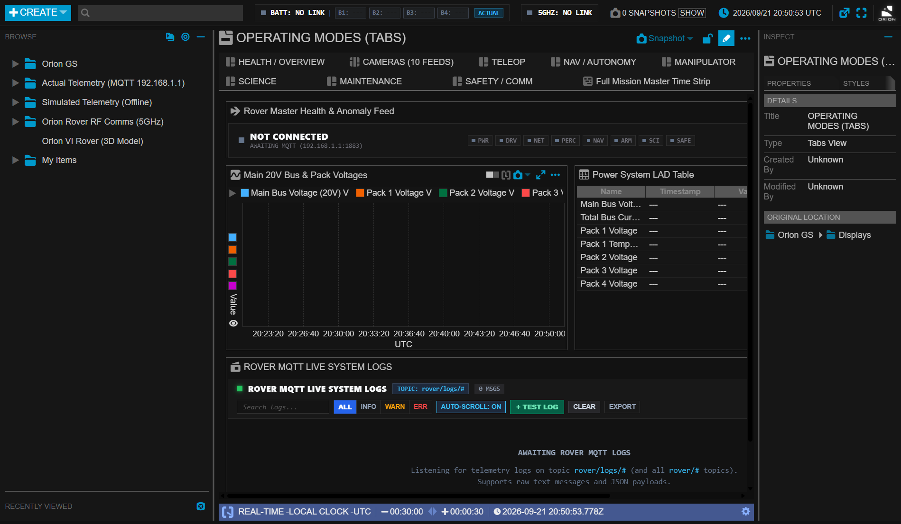
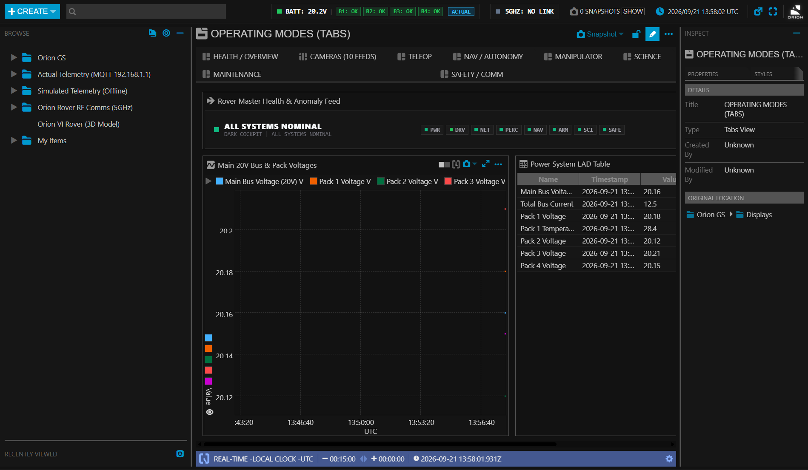
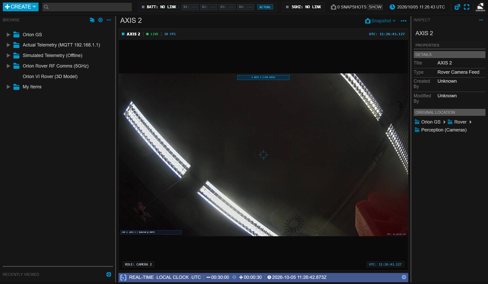
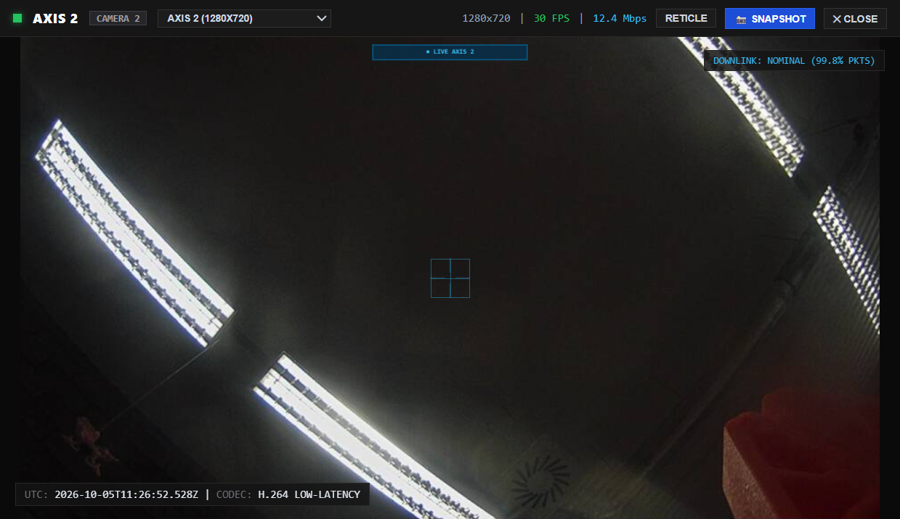
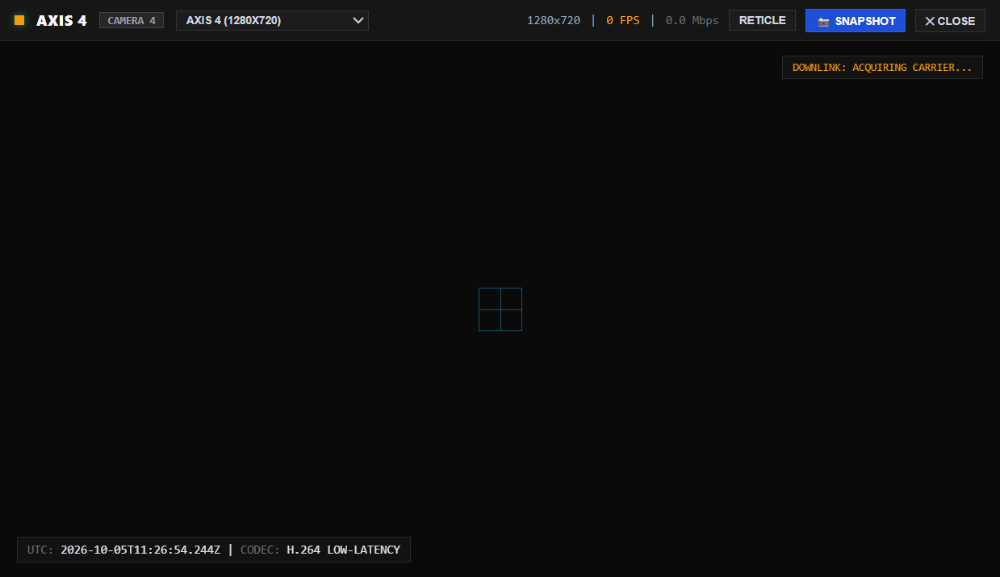
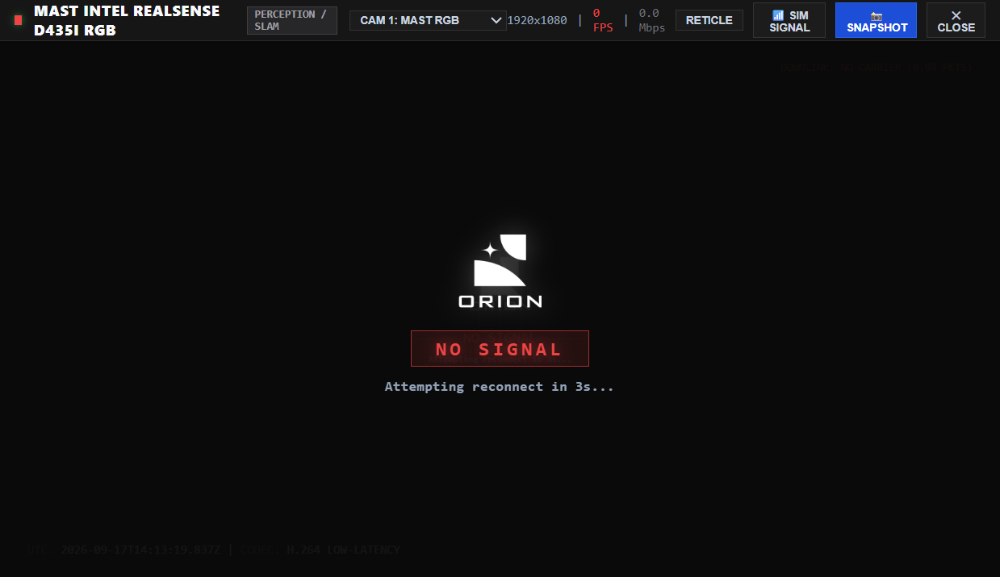
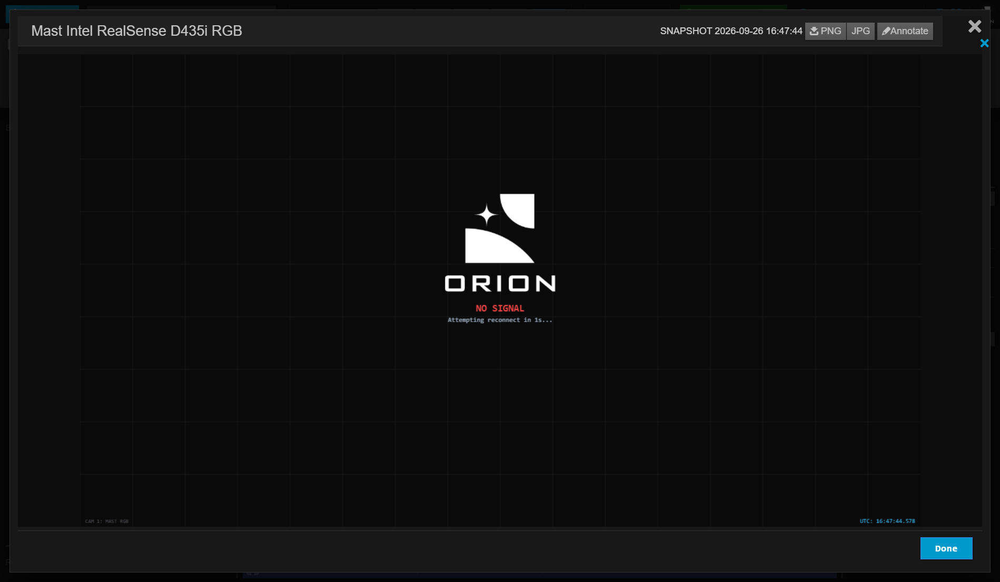

<div align="center" style="font-family: -apple-system, BlinkMacSystemFont, 'Segoe UI', Roboto, Helvetica, Arial, sans-serif;">
  
  <h1 style="margin: 0; font-size: 28px; font-weight: 800; letter-spacing: 2px; color: #f8fafc;">ORION VI ROVER — GROUND CONTROL STATION</h1>
  <p style="margin: 6px 0 16px 0; font-size: 14px; color: #94a3b8; font-weight: 500;">
    Mission Control & Telemetry System | <b>KN MicroChip</b> | <b>European Rover Challenge (ERC 2026/27)</b>
  </p>
  <p>
    
    
    
    
    
    
    
  </p>
</div>

---

<div style="font-family: -apple-system, BlinkMacSystemFont, 'Segoe UI', Roboto, Helvetica, Arial, sans-serif;">

## Overview

A mission-critical Ground Control Station (GCS) engineered for the **Orion VI Planetary Rover**, built by **KN MicroChip** for competition in the **European Rover Challenge (ERC 2026/27)**. 

Built on top of the **NASA Open MCT** framework, the station enforces strict **NASA-STD-3001** and **ECSS** human-system interface principles:
* **Aerospace Dark Palette (`#121212`)**: Low-glare, high-contrast dark environment designed for outdoor command shelters.
* **Square Edge Topology (`0px !important`)**: Zero-radius framing for maximum information density and clean visual alignment.
* **Factual Telemetry Only**: Status indicators strictly reflect verified telemetry (`[B1: OK]` when link active, `[B1: ---]` when unreceived).
* **Tabular Monospace Typography**: Monospace numeric streams prevent character-width jitter during high-frequency sensor updates.
* **Decoupled Clocks**: All telemetry displays, graphs, LAD tables, and logs stream continuously on the **UTC Real Time Clock**, while competition task timelines operate on independent **Mission Elapsed Time (MET)** starting from `0` on operator command.
* **Full Session Persistence**: Custom display layouts, tab order in `modes_tab`, grid item positions, and in-place camera names automatically persist across sessions via Open MCT `localStorage` synchronization hooks.
* **AXIS F34 Network Vision**: High-speed LAN proxy integration with the AXIS F34 multi-sensor unit, 5s grace period, 4.5s freeze watchdog, and repeating 5s force reconnect loop.

---

## Mission Interface Gallery

### 1. Operating Modes Master Dashboard (`HEALTH / OVERVIEW`)
The central operations screen integrating 9 tabbed operational layouts (`HEALTH / OVERVIEW`, `CAMERAS (12 FEEDS)`, `TELEOP`, `NAV / AUTONOMY`, `MANIPULATOR`, `SCIENCE`, `MAINTENANCE`, `SAFETY / COMM`, `Full Mission Master Time Strip`). Features the Rover Master Health & Anomaly Watchdog, the real-time **Main 20V Bus & Pack Voltages** graph streaming on the continuous UTC Real Time Clock, the Power System LAD Table, and the embedded **Rover MQTT Live System Logs Console**.



---

### 2. Main Teleoperation & Subsystem HUD
The master teleoperation dashboard integrating real-time IMU artificial horizon, robotic arm manipulator controls, subsystem power distribution strip, and live battery states on the upper HUD.


---

### 3. 5S Li-ion Battery Diagnostics & Health Monitoring
Factual **20.1V – 20.2V** nominal operating plateau monitoring with individual module health badges, parallel bus balance tracking, and standalone diagnostics window with a **14V – 22V** trend graph.

<p align="center">
  
</p>

<p align="center">
  
</p>

---

### 4. AXIS F34 Network Cameras, Dual Test Feeds & Repeating Reconnect Watchdog
Integrated **Flexible Layout** tab (`CAMERAS (12 FEEDS)` / `disp_cameras`) within Operating Modes and Rover Displays. Features live physical **AXIS F34 Network Cameras**, rover operational feeds, and dedicated operator test feeds for the **Laptop Built-in Webcam** (`cam_laptop_test`) and an external **USB Camera** (`cam_usb_test`):
- **AXIS F34 Multi-Sensor Network Camera Integration**:
  - Connects directly to the rover's **AXIS F34 4-sensor main unit** over high-speed Ethernet (link-local address `169.254.186.98`).
  - **Automatic Network Discovery**: The gateway performs SSDP M-SEARCH broadcasts over `169.254.255.255:1900` to automatically locate and bind the AXIS unit on the local subnet without hardcoded configuration.
  - **High-Throughput MJPEG Proxy**: Real-time HTTP MJPEG streaming via `/api/camera/axis/:id/stream` (standard `multipart/x-mixed-replace; boundary=myboundary`).
  - **In-Memory Stream Caching**: The gateway tracks active stream consumers to suppress background snapshot polling on the AXIS F34 embedded CPU while live video is playing.
  - **Physical Sensor Mapping**:
    - **Port 2 (`AXIS 2`)**: Live 30 FPS high-definition feed.
    - **Port 3 (`AXIS 3`)**: Live 30 FPS high-definition feed.
    - **Ports 1 & 4**: Unpopulated sensor bays (gracefully identified and held in standby).
- **Local Operator Test Feeds**:
  - **Laptop Webcam (Test Camera)**: WebRTC auto-negotiated live camera feed with green telemetry HUD (`#10b981`).
  - **USB Camera (Test Cam)**: External plug-and-play USB video feed with dedicated cyan HUD overlay (`#06b6d4`) and fail-safe device detection.
- **10 Rover Operational Feeds**: Mast RGB, Mast Depth, Hazcams (Front L/R, Rear), 360 Deck Pano, Manipulator Wrist & Elbow, Science Micro Imager & Internal Chamber.
- **5-Second Grace Period Before No Signal**:
  - When a camera stream drops, loses network packets, or disconnects, the display does NOT immediately flash black or trigger an alarm.
  - The last valid video frame remains visible and frozen for a **5-second grace period** to absorb momentary network jitter.
- **Repeating 5s Force Reconnect Loop**:
  - Once the 5s grace period expires, the display transitions to the authentic Orion standby screen (dark `#0a0a0a` grid, centered Orion VI insignia, red `NO SIGNAL` box, live UTC timestamp).
  - An active countdown timer displays: `"Attempting reconnect in 5s..."` counting down each second.
  - At count 0s, the system executes an active **FORCE RECONNECT**: destroying the existing socket/image element, issuing a fresh cache-busting connection request (`?reconnect=true&t=...`), and re-probing the camera gateway.
  - If the camera is still offline, the 5s countdown resets and repeats indefinitely until link recovery.
  - As soon as valid camera frames resume, the `NO SIGNAL` overlay immediately disappears and live video playback resumes.
- **4.5-Second Stream Freeze Watchdog**:
  - Frame arrival rates are continuously monitored on active feeds.
  - If video frames stall for longer than 4.5 seconds (video freeze), the watchdog detects the stall, tears down the hung connection, and initiates the 5s recovery sequence.
- **Native Open MCT Camera Renaming**:
  - Operators can rename any camera directly inside Open MCT using native object properties (right-click -> Edit in tree or inspector).
  - Custom camera names are automatically saved to `localStorage` under `orion-camera-custom-names` and persist across restarts.
- **Instant Snapshot Export**: Real-time snapshot buttons (`📸 SNAPSHOT`) on camera tiles, enlarged views, and standalone popout windows (`camera-view.html?id=X`) capture full-resolution PNG frames into the Open MCT Notebook snapshot drawer (`notebook-snapshot-storage`) and trigger browser downloads.


<p align="center">
  
  
</p>

<p align="center">
  
  
</p>

---

### 5. Native User Layout, Tab Ordering & Camera Name Persistence
All operator customizations made inside Open MCT persist automatically across browser refreshes, application restarts, and system reboots without requiring external database setup:
- **Display Layout Grids & Coordinates**: Modifying layout item positions, dimensions, frame borders, or adding telemetry alphanumerics and plots persists via `orion_taxonomy_dynamic_objects`.
- **Custom Displays & Objects**: Newly created user displays, custom plots, and layouts created through the `+ Create` menu survive restarts and remain anchored in the object tree.
- **Tab Ordering in Operating Modes**: Any reordering or composition updates in the master `modes_tab` container persist in `orion_taxonomy_custom_compositions`.
- **Camera In-Place Renaming**: Custom camera labels edited via Open MCT object properties are preserved via `orion-camera-custom-names`.
- **Mission Activity Schedules**: Custom task milestones, durations, and swimlane assignments configured in the in-app timeline editor persist in `orion_timeline_tasks_config`.

---

### 6. 5GHz RF Comms & Dedicated Diagnostics
Live wireless transceiver link metrics (RSSI, SNR, downlink/uplink throughput, packet loss) with real-time health indicator and detached popout diagnostics window (`antenna-details.html`).

<p align="center">
  
</p>

---

### 7. Native Open MCT Timelines, Decoupled Real-Time Clock & Pure Per-Mission MET
Full integration with native NASA Open MCT timeline engines, featuring authentic swimlane visuals, zero-drift activity anchors, decoupled Real Time Clock operation, independent per-task MET timers, separate overall mission MET, and zero-code in-app timeline customization:

* **Decoupled Real Time Clock for Telemetry & Graphs**: All telemetry graphs (`Main 20V Bus & Pack Voltages`, `Pitch & Roll Attitude Trend`, `Drive Motor Currents`), display layouts (`disp_overview`, `disp_nav`, `disp_teleop`, etc.), LAD tables, and live logs run continuously on the **UTC Real Time Clock** (`local` clock, `utc` time system). Task state changes (pausing, stopping, resetting) never freeze or disrupt real-time telemetry streaming.
* **Authentic Native Open MCT Visuals**: Retains 100% native Open MCT `plan.view` (`openmct.plugins.PlanLayout`), `time-strip.view`, and `timelist.view` rendering:
  * Authentic swimlane headers (`MET`, `Safety`, `Drive`, `Science`, `Arm`).
  * Authentic rounded SVG activity pills styled with Open MCT's official telemetry color palette.
  * Native D3 time-axis ruler and the triangular `.nowMarker` time needle tracking across elapsed time.
* **In-Timeline Interactive Controls Bar**: Positioned cleanly directly above the native plan swimlanes without disrupting layout geometry:
  * Control buttons: `▶ START`, `⏸ HOLD`, `▶ RESUME`, `✓ DONE`, `⏭ SKIP`, `⏹ STOP`, `↺ RESET`, and `⚙ EDIT`.
  * Task selector dropdown, live judges' remaining countdown (`REM: 39:59`), and active task MET (`TASK MET T+00:01`).
  * **Context-Aware Embedding**: When embedded inside composite display layouts (like the `NAV / AUTONOMY` operating mode), the plan renders purely as a native swimlane view without redundant toolbar wrappers.
* **Zero Execution on App Opening**: When opening the application or refreshing, no mission or timeline runs automatically. All 4 competition tasks (`Navigation`, `Science`, `Maintenance`, `Probing`) and the overall mission strictly initialize in `IDLE` standby with `metMs = 0`, cursor anchored at `0` (the first activity block), bounds `{ start: 0, end: limitMs }`, and conductor mode `'fixed'`.
* **Independent Per-Mission MET Starting on Operator Start**:
  * Each competition task maintains its own independent Mission Elapsed Time (MET) clock starting from `0` only when the operator explicitly clicks `▶ START` for that specific task.
  * Starting Navigation runs Navigation MET from 0 while Science, Maintenance, and Probing remain in `IDLE` standby at 0.
  * Starting Science runs Science MET from 0 while Navigation continues its own clock independently.
  * Pausing (`⏸ HOLD`) or stopping (`⏹ STOP`) freezes that task's MET and cursor instantaneously with zero drift.
  * Resetting (`↺ RESET`) returns that task to `IDLE` standby with MET `0` and anchors the cursor at the beginning of the first block.
* **Separate Overall Mission MET**: Overall Mission MET runs continuously across the rover operation session from the moment the first task is initiated. It persists independently across task switches, pauses, and resets. Both **OVERALL MISSION MET** (`+HH:mm:ss`) and active **TASK MET** (`+HH:mm:ss`) are displayed on the top HUD indicator and in-timeline toolbars.
* **Native Master Time Strip (`type: 'time-strip'`)**: Stacks multi-domain mission plans (`plan_nav`, `plan_science`) and live telemetry plots (`plot_bus_voltage`, `plot_wheel_currents`) along a unified, synchronized time axis operating on UTC Real Time Clock with a moving real-time Conductor cursor.
* **In-App Milestone & Activity Editor Modal (`⚙ EDIT TIMELINE`)**: A full-featured aerospace configuration dialog accessible from any timeline. Operators can add new milestones, modify activity names, edit durations in minutes, reassign subsystem swimlanes (`Drive`, `Arm`, `Science`, `Safety`, `Power`), pick colors, and reorder steps. Changes are saved to `localStorage` and immediately update Open MCT plans and Time Strips without reloading. Includes a 1-click `↺ RESET TO ERC DEFAULTS` button.
* **Universal Expanded View "X" Close Button**: All "Large View" expansions, flexible layout previews, modals, and popup inspectors open cleanly and reliably close immediately upon clicking the top-right "X" button, clicking the backdrop, or pressing `Escape`.

<p align="center">
  
  
</p>

<p align="center">
  
  
</p>

<p align="center">
  
  
</p>

---

### 8. Rover MQTT Live System Logs Console (`HEALTH / OVERVIEW`)
A dedicated, real-time aerospace logging terminal embedded directly into the master **HEALTH / OVERVIEW** display layout (`disp_overview`) and available as a standalone Open MCT domain object (`rover_logs_console`).

* **Live Ingestion Pipeline**: Ingests streaming text and JSON log messages transmitted from the rover over MQTT (default topic `rover/logs/#`, configurable via `MQTT_LOG_TOPIC` environment variable).
* **Dual Format Parsing**: Automatically handles both raw text log lines (e.g. `"[INFO] Navigation RTAB-Map SLAM node started"`) and structured JSON payloads (`{ level: "WARN", source: "POWER", message: "..." }`).
* **Aerospace Severity Badges**: Distinct high-contrast badges for log levels: <span style="background: #082f49; color: #7dd3fc; border: 1px solid #0369a1; padding: 1px 4px; font-weight: 800; font-size: 10px;">[INFO]</span>, <span style="background: #451a03; color: #fde68a; border: 1px solid #92400e; padding: 1px 4px; font-weight: 800; font-size: 10px;">[WARN]</span>, <span style="background: #450a0a; color: #fca5a5; border: 1px solid #7f1d1d; padding: 1px 4px; font-weight: 800; font-size: 10px;">[ERROR]</span>, <span style="background: #1e293b; color: #94a3b8; border: 1px solid #334155; padding: 1px 4px; font-weight: 800; font-size: 10px;">[DEBUG]</span>.
* **Subsystem Source Tagging**: Automatically detects and tags the subsystem origin (`NAV`, `ARM`, `POWER`, `SCIENCE`, `SAFETY`, `COMM`, `DRIVE`) from MQTT topics or JSON fields.
* **Real-Time Search & Filtering**: Client-side full-text search with instant severity level toggles (`ALL`, `INFO`, `WARN`, `ERR`).
* **Operator Utilities**: Live WebSocket sync with REST history preload (`/api/logs`), `AUTO-SCROLL: ON/OFF` toggle, in-app test log injection (`+ TEST LOG`), buffer clear, and one-click log file export.
* **Integrated Telemetry**: Seamlessly updates Open MCT telemetry points `rover.logs.latest`, `rover.logs.count`, and `rover.logs.level`.


---

### 9. Realtime Telemetry Snapshot & Open Mode Modal Overlay
Direct capture and inspection of operational displays via the integrated Open MCT Notebook snapshot system:
- **Zero-Clipping Flex Layout**: Proper CSS flexbox dimensions preventing the `.c-overlay__button-bar` (`Done` button) from being pushed off-screen.
- **Full-Fidelity Base64 Rendering**: High-contrast, sharp telemetry snapshot inspection with active annotation tools (`#snap-annotation`), reticle alignment, and one-click PNG / JPG direct exports compliant with NASA-STD-3001 ground operations.
- **Fail-Safe Modal Closure**: Reliable event propagation handling on both `.c-overlay__close-button` and the aerospace `Done` action button.

<p align="center">
  
</p>

---

## Quick Start (Zero Installation)

The project includes a pre-bundled, portable **Electron runtime** (`node_modules/electron/dist/electron.exe`) embedding both Chromium and Node.js. **No external installations of Node.js, npm, or VS Code extensions are required on Windows.**

### Option A: Windows File Explorer (Double-Click)
Double-click [`start.bat`](start.bat).

### Option B: PowerShell
```powershell
.\start.bat
```
*(or run the PowerShell launcher: `.\start.ps1`)*

> [!NOTE]
> In PowerShell, the `.\` prefix is mandatory. PowerShell requires this prefix to execute files in the current working directory for security.

### Option C: Command Prompt (CMD)
```cmd
start.bat
```

### Option D: NPM Scripts (If Node.js is Installed)
```bash
# Launch Electron native desktop window
npm start

# Launch server and auto-open default web browser at http://localhost:8088
npm run start:browser

# Launch background server only (headless)
npm run start:web
```

---

## Typography & Fonts Specification

The Orion VI Ground Control Station enforces strict aerospace typography standards across all UI components and documentation:

```
+-----------------------------------------------------------------------------------------+
| Interface Element   | Primary Font Stack                                                |
+---------------------+-------------------------------------------------------------------+
| Headings & UI Labels| -apple-system, BlinkMacSystemFont, "Segoe UI", Roboto, sans-serif |
| Telemetry & Numbers | "JetBrains Mono", "Fira Code", Consolas, "Courier New", monospace|
| Status Badges       | "SFMono-Regular", Consolas, Menlo, monospace (font-weight: 800)   |
| Time & Coordinates  | "JetBrains Mono", monospace (font-variant-numeric: tabular-nums)  |
+-----------------------------------------------------------------------------------------+
```

### Why Tabular Monospace Font Matters:
In mission-critical aerospace telemetry, numbers must render with **fixed tabular character widths** (`font-variant-numeric: tabular-nums`). If proportional fonts (like Arial or Helvetica) are used for high-frequency telemetry (such as battery voltage updating at 10Hz), numbers jitter horizontally as glyph widths change (e.g. `1` is narrower than `8`), causing operator eye fatigue and reading errors during high-stress competition runs.

---

## Subsystems Architecture & Telemetry Data Flow

```mermaid
flowchart TD
    subgraph Rover ["Orion VI Rover (Physical / Simulation)"]
        subgraph PowerSub ["Power Subsystem (BMS)"]
            B1["Pack 1 (5S Li-ion)"]
            B2["Pack 2 (5S Li-ion)"]
            B3["Pack 3 (5S Li-ion)"]
            B4["Pack 4 (5S Li-ion)"]
            Bus["20V DC Main Power Bus"]
        end
        AxisF34["AXIS F34 Multi-Sensor Unit (169.254.186.98)\nPorts 2 & 3: Live 30 FPS Streams"]
        LocalCams["Local Test Feeds (Webcam / USB)"]
        Nav["Autonomous Nav, IMU & RTAB-Map"]
        Arm["6-DoF Manipulator"]
        LogsNode["Rover Logging Daemon"]
        Broker["Mosquitto MQTT Broker (192.168.1.1:1883)"]
        
        PowerSub -->|"Power/feedback & rover/power/telemetry"| Broker
        Nav -->|"rover/nav/#"| Broker
        Arm -->|"rover/arm/#"| Broker
        LogsNode -->|"rover/logs/#"| Broker
    end

    subgraph GCS_Backend ["Ground Station Gateway (Node.js/Express :8088)"]
        Bridge["MQTT TCP Bridge (mqtt-bridge.js)"]
        Gateway["Telemetry Gateway & Ring Buffers"]
        AxisProxy["AXIS MJPEG Proxy & SSDP Gateway (/api/camera/axis/:id/stream)"]
        WSServer["WebSocket Realtime Feed (/realtime)"]
        WSBridge["WebSocket MQTT Bridge (/mqtt-bridge)"]
        HTTPServer["Static & Historical REST API (/history, /api)"]
        
        Broker <==>|"TCP Socket"| Bridge
        AxisF34 <==>|"Ethernet MJPEG / SSDP"| AxisProxy
        Bridge --> Gateway
        Gateway --> WSServer
        Bridge --> WSBridge
        Gateway --> HTTPServer
    end

    subgraph GCS_Frontend ["Open MCT Mission Control (Electron / Browser)"]
        Shell["Open MCT UI Shell (Aerospace Theme)"]
        
        subgraph TimeEngines ["Decoupled Time Systems"]
            RTC["UTC Real Time Clock (local, utc)\nContinuous 30m Window"]
            TaskClock["Task MET Engine (orion-task-clock-plugin.js)\nIndependent Start at 0 per Task"]
        end
        
        subgraph DisplaysViews ["Displays, Views & Operating Modes"]
            ModesView["Operating Modes (disp_overview, disp_nav...)"]
            PlotsView["UTC Telemetry Plots & LAD Tables"]
            LogsView["Rover MQTT Live Logs Console"]
            PlanView["Native Plan Layouts (Safety, Drive, Science, Arm)"]
            TimeStripView["Full Mission Master Time Strip"]
        end

        subgraph CustomPlugins ["Custom Orion Plugins"]
            P_Batt["OrionBatteryPlugin (Top HUD & Health)"]
            P_Cam["OrionCameraMosaicPlugin (Flexible Layout & Watchdog)"]
            P_RF["OrionAntennaPlugin (5GHz Signal)"]
            P_3D["OrionModelPlugin (Three.js 3D Rover)"]
            P_Exc["OrionExceptionEngine (Master Caution/Warn)"]
            P_Modes["OrionModesPlugin (Tabbed Operating Layouts)"]
            P_Persist["Native Persistence Hooks (localStorage: layouts, compositions, names)"]
        end

        subgraph SecondaryWindows ["Independent Windows"]
            Win_Batt["Battery Diagnostics (battery-details.html)"]
            Win_RF["RF Comms Diagnostics (antenna-details.html)"]
            Win_Cam["Detached Camera Views (camera-view.html)"]
        end

        WSServer <==>|"WebSocket"| CustomPlugins
        WSBridge <==>|"WebSocket"| P_Batt
        WSBridge <==>|"WebSocket"| LogsView
        AxisProxy <==>|"HTTP MJPEG Stream"| P_Cam
        AxisProxy <==>|"HTTP MJPEG Stream"| Win_Cam
        LocalCams <==>|"WebRTC / MediaDevices"| P_Cam
        HTTPServer <==>|"HTTP Fetch"| CustomPlugins
        
        RTC --> PlotsView
        RTC --> LogsView
        RTC --> TimeStripView
        TaskClock --> PlanView
        
        CustomPlugins --> Shell
        DisplaysViews --> Shell
        P_Batt <==>|"BroadcastChannel ('orion-battery-sync')"| Win_Batt
        P_Cam -->|"window.open"| Win_Cam
        P_RF -->|"window.open"| Win_RF
    end
```



---

## Detailed Documentation Directory

For complete engineering details, see the dedicated guides in the [`docs/`](docs/) directory:

* [**Architecture & Protocol Guide**](docs/ARCHITECTURE.md): Backend gateway, MQTT bridge, FIFO ring-buffers, decoupled clock engine, and multi-window state synchronization.
* [**Battery Subsystem Guide**](docs/BATTERY_SUBSYSTEM.md): 5S Li-ion battery curves, 20.1V–20.2V calibration, fault isolation thresholds, and diagnostics UI.
* [**Camera System Guide**](docs/CAMERA_SYSTEM.md): AXIS F34 network integration, 5s grace period, 4.5s freeze watchdog, repeating 5s force reconnect loop, native renaming, and snapshotting.
* [**Telemetry Dictionary**](docs/TELEMETRY_DICTIONARY.md): Comprehensive table of telemetry identifiers, units, limits, and payload schemas.

---

## Automated Verification Tests

The GCS includes automated headless Electron verification test suites:

```powershell
# Verify Display Layout grids, tab ordering & native camera renaming persistence
node run-electron.js --test=test_persistence
# (Alternative PowerShell env syntax: $env:TEST_RUN="test_persistence"; & "node_modules\electron\dist\electron.exe" .)

# Verify AXIS F34 streams, 5s grace period, repeating 5s force reconnect & freeze watchdog
node run-electron.js --test=test_cameras

# Verify timeline initiation standby gating & Rover MQTT Live Logs console
node run-electron.js --test=test_timeline_and_logs

# Verify native Open MCT Plan layouts, Time Strips, Timelists & Nav embedded plan
node run-electron.js --test=test_timeline

# Verify timeline interactive controls (start, pause, resume, reset, edit)
node run-electron.js --test=test_timeline_controls

# Verify battery telemetry, top panel indicators & diagnostics window
node run-electron.js --test=test_battery

# Verify telemetry snapshot capture and modal overlay
node run-electron.js --test=test_snapshot

# Full end-to-end telemetry ingestion test
node run-electron.js --test=e2e
```

---

## License & Team
* **Team**: KN MicroChip — Orion Rover Team
* **Competition**: European Rover Challenge (ERC 2026/27)
* **Core Framework**: [NASA Open MCT](https://nasa.github.io/openmct/) (Apache 2.0 License)

</div>
