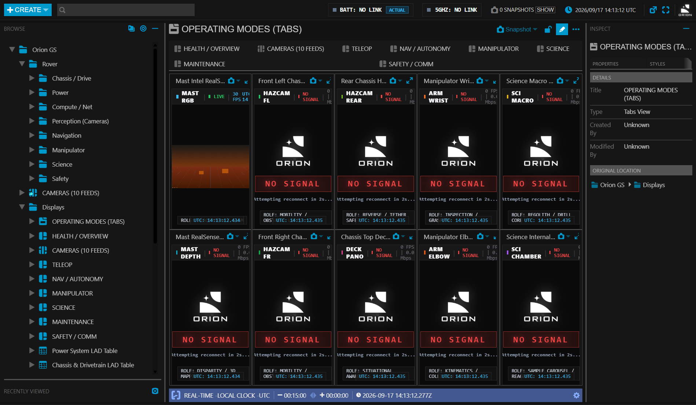
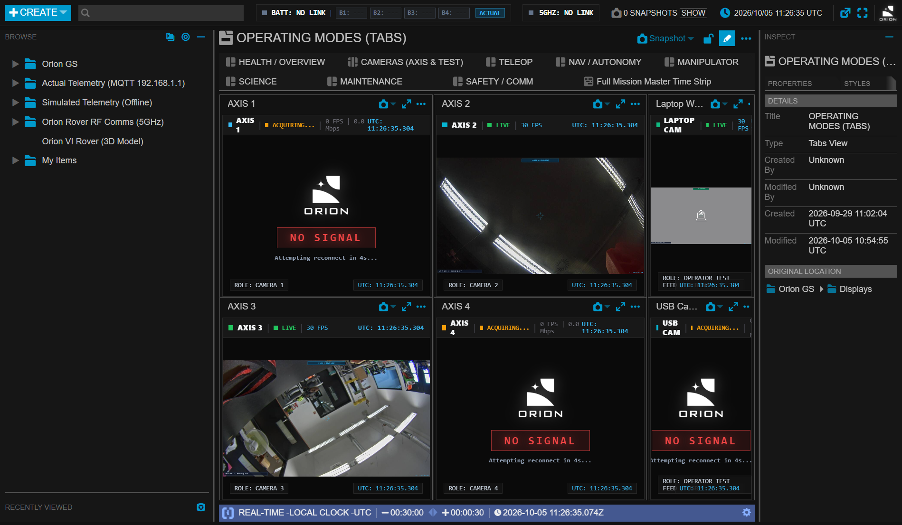
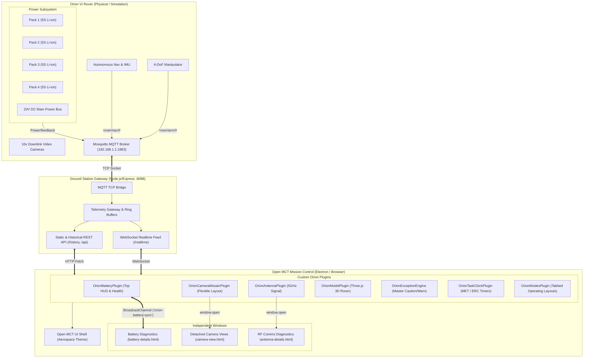

<div align="center" style="font-family: -apple-system, BlinkMacSystemFont, 'Segoe UI', Roboto, Helvetica, Arial, sans-serif;">
  
  <h1 style="margin: 0; font-size: 28px; font-weight: 800; letter-spacing: 2px; color: #f8fafc;">ORION VI ROVER — GROUND CONTROL STATION</h1>
  <p style="margin: 6px 0 16px 0; font-size: 14px; color: #94a3b8; font-weight: 500;">
    Mission Control & Telemetry System | <b>KN MicroChip</b> | <b>European Rover Challenge (ERC 2026/27)</b>
  </p>
  <p>
    
    
    
    
    
    
  </p>
</div>

---

<div style="font-family: -apple-system, BlinkMacSystemFont, 'Segoe UI', Roboto, Helvetica, Arial, sans-serif;">

## Overview

A mission-critical Ground Control Station (GCS) engineered for the **Orion VI Planetary Rover**, built by **KN MicroChip** for competition in the **European Rover Challenge (ERC 2026/27)**. 

Built on top of the **NASA Open MCT** framework, the station enforces strict **NASA-STD-3001** and **ECSS** human-system interface principles:
* **Aerospace Dark Palette (`#121212`)**: Low-glare, high-contrast dark environment designed for outdoor command shelters.
* **Square Edge Topology (`0px !important`)**: Zero-radius framing for maximum information density and clean visual alignment.
* **Factual Telemetry Only**: Status indicators strictly reflect verified telemetry (`[B1: OK]` when link active, `[B1: ---]` when unreceived).
* **Tabular Monospace Typography**: Monospace numeric streams prevent character-width jitter during high-frequency sensor updates.

---

## Mission Interface Gallery

### 1. Main Teleoperation & Subsystem HUD
The master teleoperation dashboard integrating real-time IMU artificial horizon, robotic arm manipulator controls, subsystem power distribution strip, and live battery states on the upper HUD.


---

### 2. 5S Li-ion Battery Diagnostics & Health Monitoring
Factual **20.1V – 20.2V** nominal operating plateau monitoring with individual module health badges, parallel bus balance tracking, and standalone diagnostics window with a **14V – 22V** trend graph.

<p align="center">
  
</p>

<p align="center">
  
</p>

---

### 3. 10-Camera Flexible Layout & Reconnect Watchdog
Integrated **Flexible Layout** tab (`rover_cameras_flex`) within Rover Displays. Features primary hero view (Mast Camera), 9 auxiliary feeds, 5-second automatic reconnect watchdog, and independent sub-window popouts for multi-monitor command desks.



<p align="center">
  
  
</p>

### 4. 5GHz RF Comms & Dedicated Diagnostics
Live wireless transceiver link metrics (RSSI, SNR, downlink/uplink throughput, packet loss) with real-time health indicator and detached popout diagnostics window (`antenna-details.html`).

<p align="center">
  
</p>

---

### 5. Native Open MCT Timelines, Time Strips & Task Plans
Full integration with native NASA Open MCT timeline engines:
* **Native Master Time Strip (`type: 'time-strip'`)**: Stacks multi-domain mission plans (`plan_nav`, `plan_science`) and live telemetry plots (`plot_bus_voltage`, `plot_wheel_currents`) along a unified, synchronized time axis with a moving real-time Conductor cursor.
* **Native Plan Layouts (`type: 'plan'`)**: High-performance canvas-rendered swimlanes (`Safety`, `Drive`, `Science`, `Arm`) with NASA-STD-3001 aerospace color coding, clickable activities, and full Conductor bounds synchronization.
* **Display Layout Integration**: Embedded plan views within single-screen operating modes (`NAV / AUTONOMY`, `SCIENCE`, `MANIPULATOR`, `MAINTENANCE`) alongside LAD tables and telemetry graphs.
* **Activity Time List (`type: 'timelist'`)**: Time-ordered tabular schedule showing active, past, and upcoming tasks with automatic count-up / count-down timers.


<p align="center">
  
  
</p>

<p align="center">
  
</p>

---

## Quick Start (Zero Installation)

The project includes a pre-bundled, portable **Electron runtime** (`node_modules/electron/dist/electron.exe`) embedding both Chromium and Node.js. **No external installations of Node.js, npm, or VS Code extensions are required on Windows.**

### Option A: Windows File Explorer (Double-Click)
Double-click [`start.bat`](start.bat).

### Option B: PowerShell
```powershell
.\start.bat
```
*(or run the PowerShell launcher: `.\start.ps1`)*

> [!NOTE]
> In PowerShell, the `.\` prefix is mandatory. PowerShell requires this prefix to execute files in the current working directory for security.

### Option C: Command Prompt (CMD)
```cmd
start.bat
```

### Option D: NPM Scripts (If Node.js is Installed)
```bash
# Launch Electron native desktop window
npm start

# Launch server and auto-open default web browser at http://localhost:8088
npm run start:browser

# Launch background server only (headless)
npm run start:web
```

---

## Typography & Fonts Specification

The Orion VI Ground Control Station enforces strict aerospace typography standards across all UI components and documentation:

```
+-----------------------------------------------------------------------------------------+
| Interface Element   | Primary Font Stack                                                |
+---------------------+-------------------------------------------------------------------+
| Headings & UI Labels| -apple-system, BlinkMacSystemFont, "Segoe UI", Roboto, sans-serif |
| Telemetry & Numbers | "JetBrains Mono", "Fira Code", Consolas, "Courier New", monospace|
| Status Badges       | "SFMono-Regular", Consolas, Menlo, monospace (font-weight: 800)   |
| Time & Coordinates  | "JetBrains Mono", monospace (font-variant-numeric: tabular-nums)  |
+-----------------------------------------------------------------------------------------+
```

### Why Tabular Monospace Font Matters:
In mission-critical aerospace telemetry, numbers must render with **fixed tabular character widths** (`font-variant-numeric: tabular-nums`). If proportional fonts (like Arial or Helvetica) are used for high-frequency telemetry (such as battery voltage updating at 10Hz), numbers jitter horizontally as glyph widths change (e.g. `1` is narrower than `8`), causing operator eye fatigue and reading errors during high-stress competition runs.

---

## Subsystems Architecture



---

## Detailed Documentation Directory

For complete engineering details, see the dedicated guides in the [`docs/`](docs/) directory:

* [**Architecture & Protocol Guide**](docs/ARCHITECTURE.md): Backend gateway, MQTT bridge, FIFO ring-buffers, and multi-window state synchronization.
* [**Battery Subsystem Guide**](docs/BATTERY_SUBSYSTEM.md): 5S Li-ion battery curves, 20.1V–20.2V calibration, fault isolation thresholds, and diagnostics UI.
* [**Camera System Guide**](docs/CAMERA_SYSTEM.md): 10-camera flexible layout, reconnect watchdog mechanism, streaming architecture, and snapshotting.
* [**Telemetry Dictionary**](docs/TELEMETRY_DICTIONARY.md): Comprehensive table of telemetry identifiers, units, limits, and payload schemas.

---

## Automated Verification Tests

The GCS includes automated headless Electron verification scripts:

```powershell
# Verify battery telemetry, top panel indicators & diagnostics window
$env:TEST_RUN="test_battery"; & "node_modules\electron\dist\electron.exe" .

# Verify 10-camera flexible layout & reconnect watchdog countdown
$env:TEST_RUN="test_cameras"; & "node_modules\electron\dist\electron.exe" .

# Verify native Open MCT Plan layouts, Time Strips & Timelists
$env:TEST_RUN="test_timeline"; & "node_modules\electron\dist\electron.exe" .

# Full end-to-end telemetry ingestion test
$env:TEST_RUN="e2e"; & "node_modules\electron\dist\electron.exe" .
```

---

## License & Team
* **Team**: KN MicroChip — Orion Rover Team
* **Competition**: European Rover Challenge (ERC 2026/27)
* **Core Framework**: [NASA Open MCT](https://nasa.github.io/openmct/) (Apache 2.0 License)

</div>
