# Orion VI GCS — Architecture & Data Flow Guide
### European Rover Challenge (ERC 2026/27) | KN MicroChip

This document provides a technical specification of the software architecture, data flow pipelines, communication protocols, and state synchronization mechanisms within the **Orion VI Ground Control Station (GCS)**.

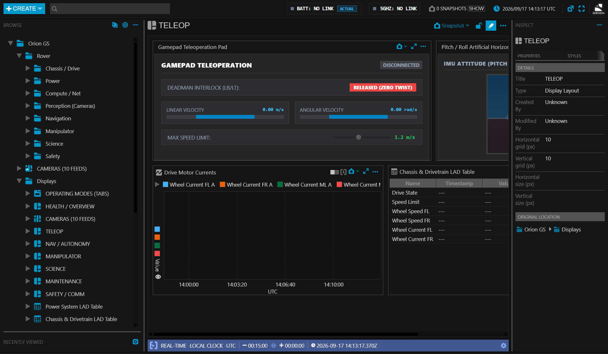

---

## Typography & Interface Font Specification

The Ground Control Station enforces strict typography rules based on **NASA-STD-3001** (Human Integration Design Handbook) and **ECSS-E-ST-70-11C** (Space Engineering: Space segment operations):

```
+-----------------------------------------------------------------------------------------+
| Element Type        | Target Font Family                                                |
+---------------------+-------------------------------------------------------------------+
| System Headings     | -apple-system, BlinkMacSystemFont, "Segoe UI", Roboto, sans-serif |
| Form Controls & Menus| -apple-system, BlinkMacSystemFont, "Segoe UI", Roboto, sans-serif |
| Live Sensor Feeds   | "JetBrains Mono", Consolas, Monaco, "Courier New", monospace       |
| Status Badges (OK/WARN)| "SFMono-Regular", Consolas, monospace (font-weight: 800)       |
| Time & GPS Telemetry| "JetBrains Mono", monospace (font-variant-numeric: tabular-nums)  |
+-----------------------------------------------------------------------------------------+
```

### Purpose of Fixed-Width (Tabular) Numerics
High-frequency telemetry updates (such as bus current or battery voltage fluctuating at 10Hz) cause horizontal visual jitter if proportional fonts are used, inducing operator reading errors. All telemetry displays throughout the Orion GCS use monospace tabular digits (`font-variant-numeric: tabular-nums`).

---

## 1. System High-Level Topology

The Orion VI Ground Control Station is organized into three distinct tiers:

```
+-------------------------------------------------------------+
|                      1. PHYSICAL ROVER                      |
|  - STM32 / ESP32 Power BMS & Sensors                        |
|  - Raspberry Pi / Jetson On-Board Computer                  |
|  - Mosquitto MQTT Broker (192.168.1.1:1883)                 |
+------------------------------+------------------------------+
                               |
                   5GHz Wi-Fi / Ethernet TCP
                               |
+------------------------------v------------------------------+
|                   2. GROUND STATION GATEWAY                 |
|  - Express HTTP & WebSocket Server (port 8088)              |
|  - MQTT-to-WebSocket Bridge (example-server/mqtt-bridge.js) |
|  - In-Memory Telemetry Ring Buffers (2,000 points/channel)  |
|  - REST APIs: Commanding, Camera Watchdog, History          |
+------------------------------+------------------------------+
                               |
              Local IPC / WebSocket / BroadcastChannel
                               |
+------------------------------v------------------------------+
|                     3. MISSION CONTROL UI                   |
|  - NASA Open MCT Shell (Custom Aerospace Dark Theme)        |
|  - Three.js 3D Rover Kinematics Digital Twin                |
|  - Real-time LAD Tables, Condition Sets & Strip Charts      |
|  - Multi-Window Subsystems (Battery, Antenna, Cameras)      |
+-------------------------------------------------------------+
```

---

## 2. Ingress & Transport Pipelines

### 2.1 Rover Ingress (MQTT)
* **Broker**: Mosquitto MQTT broker hosted on the rover's primary on-board computer (`192.168.1.1:1883`).
* **Connection**: The GCS backend establishes an outbound TCP socket to the broker using the `mqtt` library (`example-server/mqtt-bridge.js`).
* **Topics Ingested**:
  - `Power/#`: Comprehensive power bus, individual battery pack voltages, current draw, and temperatures.
  - `rover/nav/#`: Navigation state, GPS coordinates, IMU attitude (pitch, roll, yaw), odometry.
  - `rover/arm/#`: 6-axis joint angles, Cartesian end-effector coordinates, gripper state.
  - `rover/science/#`: Soil sensor readings, carousel position, UV/fluorescence spectrometer data.
  - `rover/antenna/#`: 5GHz wireless transceiver link metrics (RSSI, SNR, throughput, retry rates).

### 2.2 In-Memory Telemetry Gateway (`example-server/telemetry-gateway.js`)
* Stores the latest state of all telemetry channels in memory (`Map<string, TelemetryPoint>`).
* Maintains a historical FIFO ring buffer of up to **2,000 records per channel** to support instant telemetry backfilling when new views or graphs are opened in Open MCT.
* Handles simulation mode toggles: when offline, the gateway can generate realistic synthetic telemetry for mission practice and automated testing.

### 2.3 Client Egress (WebSocket & REST)
* **Realtime Stream**: `/realtime` (WebSocket). When Open MCT views subscribe to a telemetry point (e.g. `subscribe rover.power.bus.voltage`), the gateway dispatches new samples as JSON packets over WebSocket at up to 10Hz.
* **Historical Queries**: `GET /history/:pointId?start=:ms&end=:ms`. Open MCT queries this endpoint when initial plots and tables load to fetch time-series historical windows.
* **Command Dispatch**: `POST /api/command`. Transmits JSON payloads (`{ action: 'estop' }`, `{ action: 'set_mode', mode: 'teleop' }`) from GCS UI to the rover.

---

## 3. Open MCT Frontend Integration

### 3.1 Plugin Ecosystem
The Open MCT frontend (`openmct-tutorial/index.html`) installs both standard Open MCT components and custom Orion plugins:

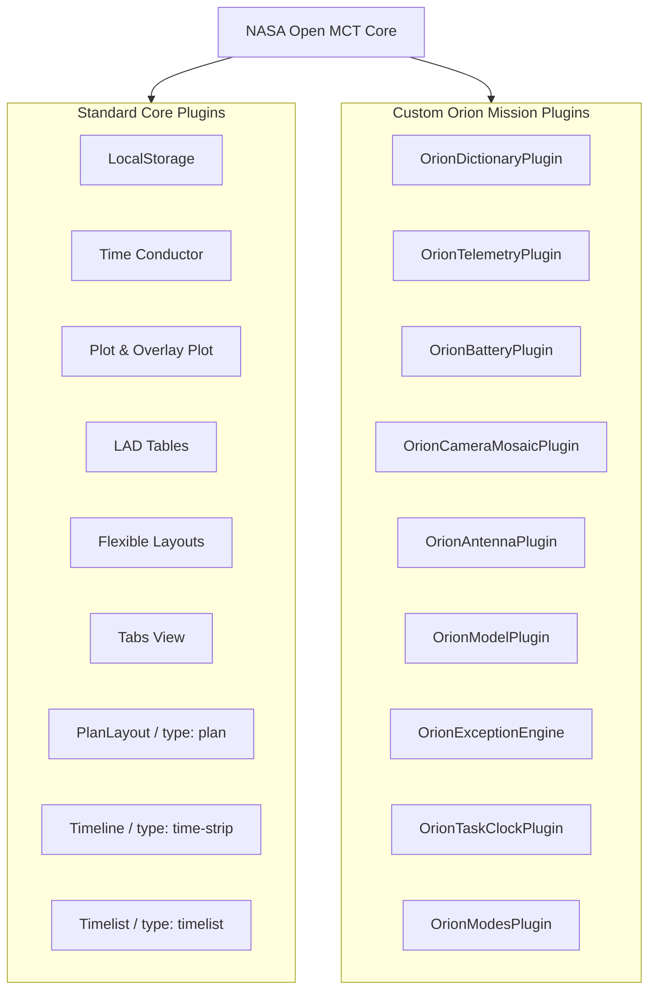

### 3.2 Taxonomy & Object Tree (`orion-dictionary-plugin.js`)
The rover telemetry points and mission operations are exposed as native Open MCT **Domain Objects** arranged in a hierarchical tree:
* `Orion VI Rover` (Root Folder)
  * `Power System`: Bus Voltage, Bus Current, Battery 1..4 Voltages, Battery Temperatures, SoC.
  * `Drive & Mobility`: Left/Right Speeds, Wheel Current, Steering Angles.
  * `Manipulator (Arm)`: Joints J1–J6, Gripper Position, Effort/Torque.
  * `Navigation & Pose`: Pitch, Roll, Heading, Lat/Long Coordinates, Obstacle Distance.
  * `Science Bay`: Carousel Index, Drill Depth, Moisture Sensor, Spectrometer Status.
  * `Communications`: 5GHz RSSI, SNR, Downlink Throughput, Uplink Throughput.
* `Task Plans & Timelines` (Root Folder)
  * `Full Mission Master Time Strip` (`type: time-strip`): Synchronized master time strip combining navigation and science plans with motor current and bus voltage telemetry plots.
  * `Navigation Traverse Plan` (`type: plan`): Native swimlane plan layout with safety and drive autonomy milestones.
  * `Science Task Plan` (`type: plan`): Surface sample acquisition, coring, and spectrometry activity plan.
  * `Maintenance Task Plan` (`type: plan`): ERC panel servicing sequence.
  * `Probing Task Plan` (`type: plan`): Geological cache search and stowing steps.
  * `Navigation Activities Time List` (`type: timelist`): Chronological execution table with count-up/count-down timers.
* `Displays` (Root Folder)
  * `OPERATING MODES (TABS)`: Single-screen operations tabs, including `TIMELINE`.
  * Display Layouts (`disp_overview`, `disp_cameras`, `disp_teleop`, `disp_nav`, `disp_manipulator`, `disp_science`, `disp_maintenance`, `disp_safety`).

### 3.3 Real Time Clock & Independent MET Timeline Architecture
The telemetry and timeline systems integrate native Open MCT plugins with Orion's custom Task Clock engine (`orion-task-clock-plugin.js`), decoupling real-time telemetry streaming from competition task execution:

1. **Continuous Real Time Clock for Telemetry, Displays, Graphs, Tables & Logs**:
   - **Default System = UTC Realtime**: On application launch, Open MCT's global Time Conductor strictly initializes and operates in `timeSystem: 'utc'`, `clock: 'local'`, and `mode: 'realtime'` with a standard 30-minute past / 30-second future window.
   - **Decoupled Telemetry Streaming**: All telemetry plots (`plot_bus_voltage`, `plot_wheel_currents`, `plot_nav_pitch_roll`, overlay plots), display layouts (`disp_overview`, `disp_nav`, `disp_teleop`, `disp_cameras`, etc.), telemetry tables (LAD tables `lad_power`, `lad_nav`, etc.), and the MQTT live logs console (`rover_logs_console`) read and plot data on the continuous Real Time Clock matching incoming rover telemetry timestamps (`utc = Date.now()`).
   - **Zero Inactive Interference**: Telemetry displays, plots, LAD tables, and logs run completely uninterrupted regardless of task timeline states. An unstarted, held, or stopped task timeline NEVER freezes, pauses, or drops ticks on the real-time clock.
   - **Automatic Route Switching**: Navigating between displays, operating modes, plots, or logs automatically ensures the Time Conductor remains in UTC Realtime mode.

2. **Independent Per-Mission MET Clocks**:
   - **Zero Launch Execution**: On application launch or page refresh, all competition tasks (`navigation`, `science`, `maintenance`, `probing`) and the overall mission strictly initialize in `IDLE` standby with `metMs = 0`, cursor locked at `00:00:00`, and bounds `{ start: 0, end: limitMs }`. No task timeline ever runs automatically upon opening the application.
   - **Independent Start & Timers**: Each ERC mission maintains its own independent state (`IDLE`, `RUNNING`, `HELD`, `STOPPED`), `t0` timestamp, hold accumulator (`hold_s`), and active step index. Each mission's MET clock starts at `0` strictly when the operator clicks `▶ START` for that specific task. Starting Navigation does not affect Science, Maintenance, or Probing.
    - **Dedicated MET Plan Views**: When navigating specifically to dedicated task plans (`#/browse/orion.taxonomy:plan_*`), the view operates on Mission Elapsed Time (`timeSystem: 'met'`) permanently anchored at `0` (the first activity block), with bounds locked to `{ start: 0, end: limitMs }`. Open MCT natively renders authentic swimlanes, rounded SVG activity pills, and the triangular `.nowMarker` needle, with an in-timeline controls toolbar directly integrated above the swimlanes.
    - **Zero Motion When Inactive**: While a task is in `IDLE`, `HELD`, or `STOPPED` state, its MET cursor and needle indicators remain completely motionless until explicitly started or resumed.

3. **Master Mission Time Strip (`timeline_mission`)**:
    - Operates on the Real Time Clock (UTC Realtime), combining real-time telemetry plots with active and future task plans. When tasks are unstarted, their activities are parked in standby. Once a task is started, its activities align with the operator's actual execution time window.

4. **Dual Telemetry Domain Hints**:
    - All telemetry objects expose both `utc` (domain 1) and `met` (domain 2) hints in `telemetry.values`, completely preventing Open MCT metadata mismatch warnings across any active time system.

5. **Separate Overall Mission MET**:
    - Runs continuously and independently across the entire rover deployment session from the moment the first task is initiated.
    - Displayed alongside active Task MET in both the top HUD banner (`OVERALL MISSION MET: +HH:mm:ss | TASK MET: +HH:mm:ss`) and the in-timeline control toolbars.

6. **Interactive Controls & In-App Milestone Editor**:
    - In-timeline controls (`▶ START`, `⏸ HOLD`, `▶ RESUME`, `⏹ STOP`, `↺ RESET`) allow instant task state transitions.
    - The in-app modal (`⚙ EDIT TIMELINE`) enables real-time adjustments to milestone steps, durations, swimlanes, and colors, saving directly to local storage and re-rendering plans and Time Strips instantly.

7. **Time Strip (`openmct.plugins.Timeline`)**:
    - Acts as a container (`type: 'time-strip'`) that composes multiple plans and telemetry plots.
    - All stacked child objects share a common synchronized time axis with a moving vertical current-time indicator.

8. **Plan Layout (`openmct.plugins.PlanLayout`)**:
    - Provides `type: 'plan'`. Activities are provided via `selectFile.body` grouped into categories (`Safety`, `Drive`, `Science`, `Arm`).
    - Dynamically bounds-checked against the Time Conductor (`viewBounds.start`, `viewBounds.end`) and renders responsive activity blocks.

9. **Time List (`openmct.plugins.Timelist`)**:
    - Provides `type: 'timelist'`. Formats milestone activities into a sortable table with relative offsets (`+HH:MM:SS` past, `-HH:MM:SS` upcoming).

<p align="center">
  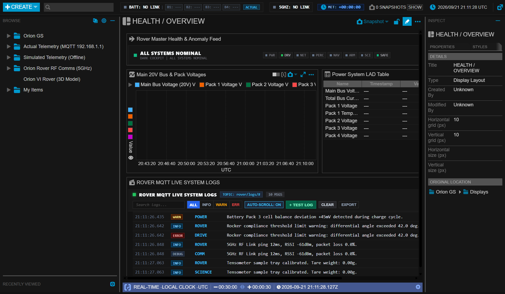
</p>

<p align="center">
  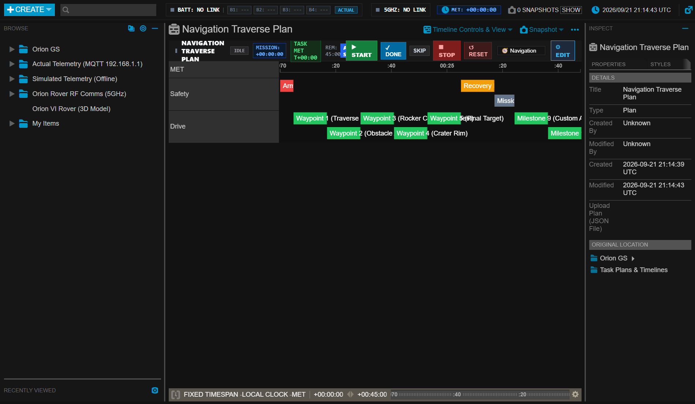
  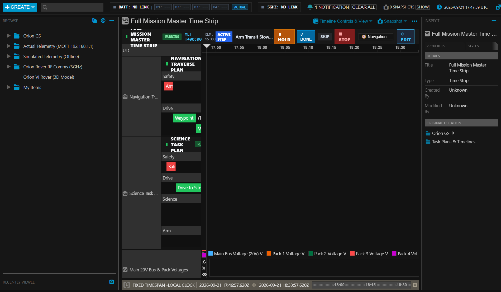
</p>

<p align="center">
  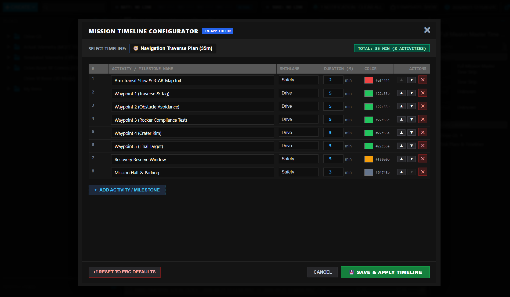
</p>

<p align="center">
  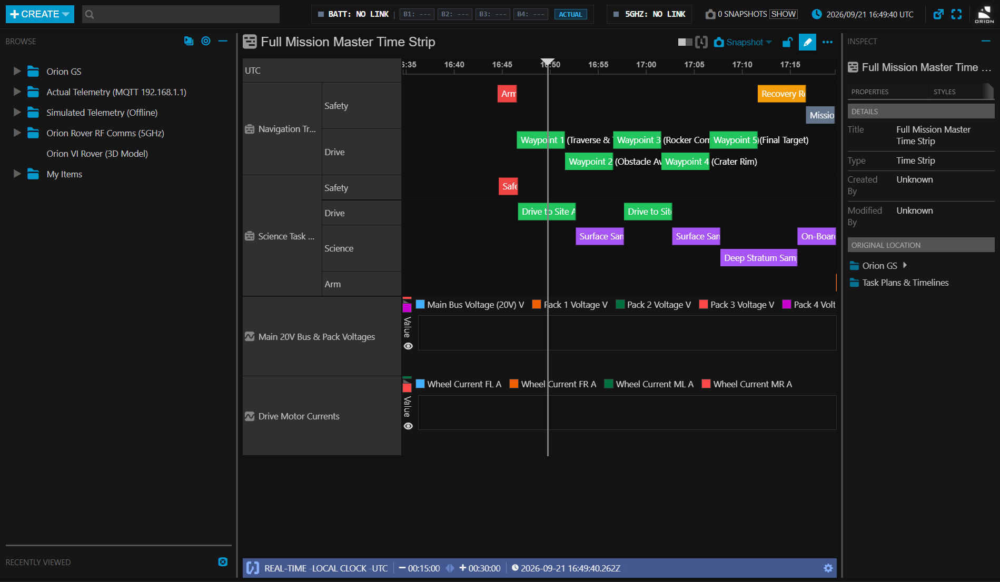
  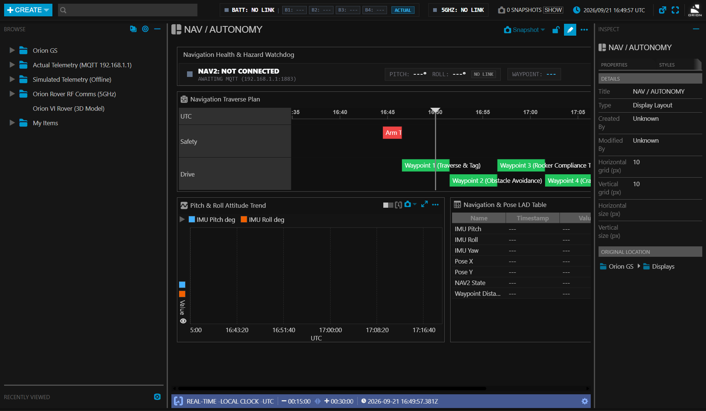
</p>

<p align="center">
  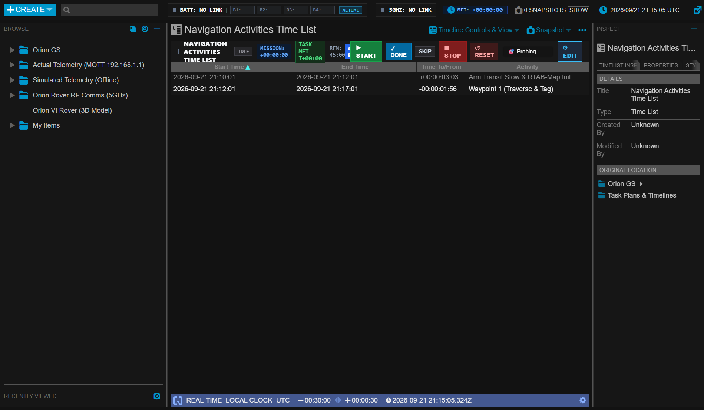
  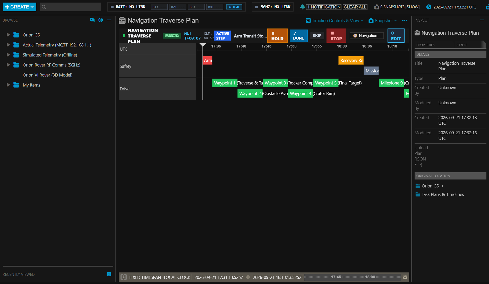
</p>

---

## 4. Multi-Window IPC & State Synchronization

The Orion GCS allows mission operators to detach critical views into independent windows across multiple monitors (e.g. detailed battery telemetry, RF comms, and detached camera feeds).

<p align="center">
  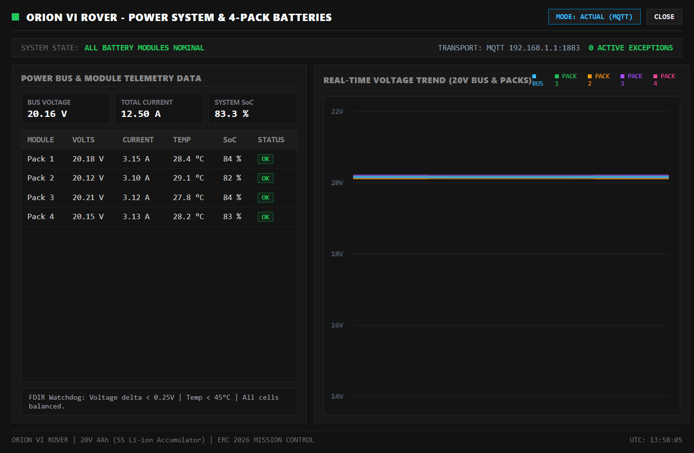
  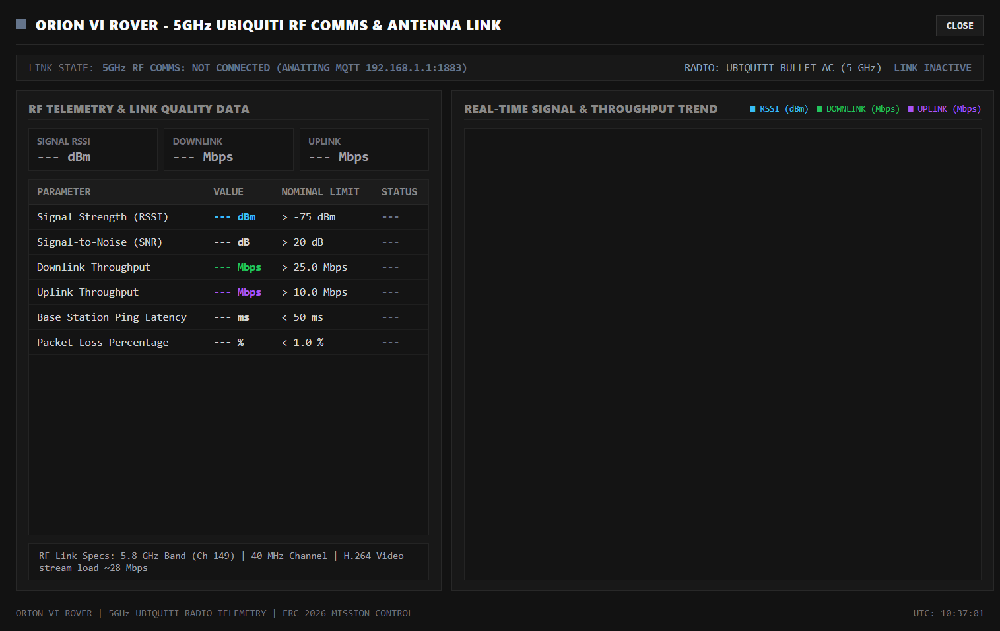
</p>

### 4.1 BroadcastChannel Synchronization
* **Channel Name**: `orion-battery-sync`
* **Mechanism**: When an operator switches between **ACTUAL** and **SIMULATED** telemetry in either the main Open MCT window or the detached [`battery-details.html`](../openmct-tutorial/battery-details.html) window, a message is broadcast:
  ```json
  { "action": "switch_mode", "mode": "actual", "timestamp": 1726748900000 }
  ```
* All open windows immediately listen and synchronize their UI state without requiring a page reload.

### 4.2 Electron Window Intercepts (`main.js`)
In Electron desktop mode, `webContents.setWindowOpenHandler()` intercepts popouts:
- Windows opening `battery-details.html`, `antenna-details.html`, or `camera-view.html` are configured with native frameless or dedicated aspect ratios, persistent dimensions, and automatic menu suppression.

---

## 5. Styling & Visual Standards (NASA-STD-3001)

The Ground Control Station complies with strict aerospace human factors standards:
1. **Square Edges (`0px !important`)**: All rounded corners are overridden to 0px across all panels, frames, and buttons for maximum visual density and sharp professional alignment.
2. **High-Contrast Dark Theme (`#121212`)**: Background luminance is minimized (`#121212` / `#161616`) to reduce glare in low-light command tents during competition field operations.
3. **Master Caution & Warning (MC&W)**:
   - **Critical / Danger**: `#ef4444` (Pure red, high urgency).
   - **Warning / Caution**: `#f59e0b` (Amber/yellow, attention required).
   - **Nominal / OK**: `#10b981` (Bright emerald green).
   - **Offline / Inactive**: `#64748b` (Neutral slate gray).
4. **Non-Intrusive Notifications**: Routine connection handshakes and transient telemetry packet delays do NOT spawn persistent toast banners, preventing UI clutter during operations.

