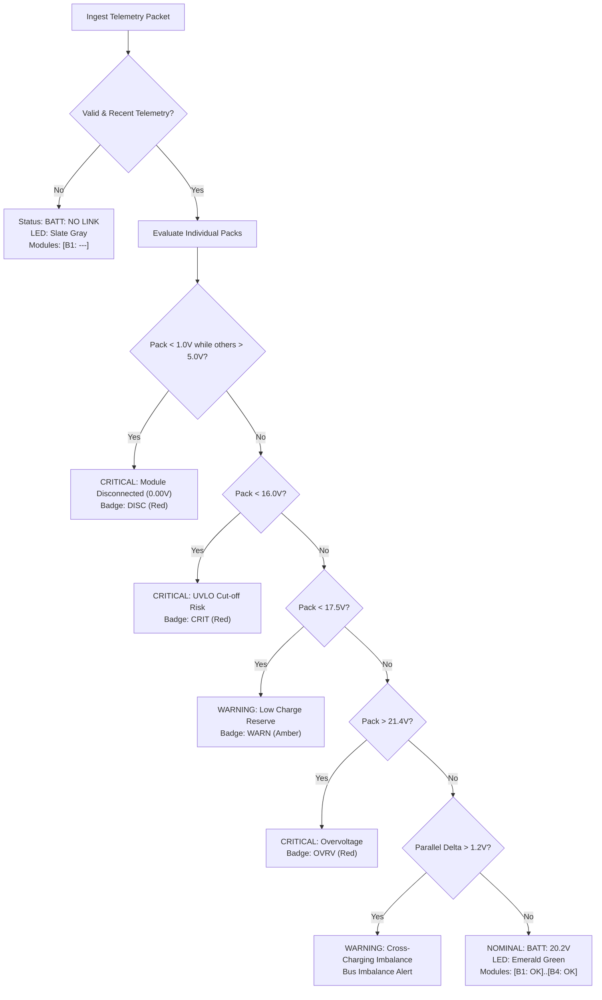

# Orion VI Rover — Battery & Power Subsystem Guide
### 5S Li-ion Accumulator Architecture & Health Diagnostics

This document outlines the electrical specifications, telemetry calibration, safety thresholds, and health monitoring logic implemented for the **20V 4Ah Lithium-Ion Power System** of the Orion VI Rover.

---

## Visual Interface & Diagnostics

### 1. Top Panel Status Indicator
Integrated in the upper mission control HUD, displaying active pack status and factual nominal voltage:


### 2. Standalone Diagnostics Window (`battery-details.html`)
Comprehensive power analytics dashboard featuring KPI cards, individual module health badges, and an aerospace **14V – 22V** trend graph with parallel bus voltage tracking:


---

## Typography & Tabular Numerics

Telemetry displays for the power subsystem enforce fixed-width monospace tabular digits:
```css
font-family: "JetBrains Mono", Consolas, "Courier New", monospace;
font-variant-numeric: tabular-nums;
```
*Because voltage, current, and SoC change continuously at 5Hz–10Hz, tabular numbers prevent horizontal jitter and visual vibration, allowing operators to instantly distinguish subtle millivolt drops or cross-charging currents.*

---

## 1. Electrical Architecture

The rover power distribution system utilizes **four parallel-connected 5S Li-ion battery modules** powering the main DC bus:

```
[Module 1 (5S)] ----+
[Module 2 (5S)] ----+---> Main 20V DC Bus ---> Drive Motors & Core Electronics
[Module 3 (5S)] ----+
[Module 4 (5S)] ----+
```

### Chemistry & Operating Voltages (5S Configuration)
- **Cell Chemistry**: Cylindrical Li-ion (e.g. 18650 / 21700).
- **Nominal Cell Voltage**: 3.7V / cell (5S = 18.5V nominal uncharged).
- **Maximum Charged Voltage**: 4.20V / cell (5S = **21.00V** maximum pack voltage).
- **Nominal Loaded Operating Plateau**: **4.02V – 4.05V / cell** (5S = **20.10V – 20.25V**).
- **Low Reserve Threshold**: 3.50V / cell (5S = **17.50V**).
- **Critical Cut-off (UVLO)**: 3.20V / cell (5S = **16.00V**).

---

## 2. Telemetry Calibration & Nominal Baseline

Following physical telemetry measurements on the rover power bus, all telemetry engines, mock generators, and UI indicators are calibrated to the **factual nominal loaded operating window (~20.1V – 20.2V)**:

| Metric | Calibrated Baseline Value | Display Format |
| :--- | :--- | :--- |
| **Main Bus Voltage** | `20.16 V` | Top HUD: `BATT: 20.2V` / Details: `20.16 V` |
| **Battery Module 1 (B1)** | `20.18 V` | HUD Badge: `[B1: OK]` / Row: `20.18 V` |
| **Battery Module 2 (B2)** | `20.12 V` | HUD Badge: `[B2: OK]` / Row: `20.12 V` |
| **Battery Module 3 (B3)** | `20.21 V` | HUD Badge: `[B3: OK]` / Row: `20.21 V` |
| **Battery Module 4 (B4)** | `20.15 V` | HUD Badge: `[B4: OK]` / Row: `20.15 V` |
| **Bus Current Draw** | `12.50 A` (typical loaded) | KPI Tile: `12.50 A` |
| **State of Charge (SoC)** | `83.3 %` (at 20.16V) | KPI Tile: `83.3 %` |
| **Pack Temperature** | `28.2 °C` | KPI Tile: `28.2 °C` |

### State of Charge (SoC) Calculation
The battery plugin computes State of Charge linearly over the active discharge window:
$$\text{SoC} = \frac{V_{\text{bus}} - 16.0\text{V}}{21.0\text{V} - 16.0\text{V}} \times 100\%$$
* At $21.00\text{V}$: $\text{SoC} = 100.0\%$
* At $20.16\text{V}$: $\text{SoC} \approx 83.3\%$
* At $17.50\text{V}$: $\text{SoC} = 30.0\%$
* At $16.00\text{V}$: $\text{SoC} = 0.0\%$

---

## 3. Health Monitoring & Fault Isolation Logic

The health monitoring engine (`orion-battery-plugin.js`) runs continuous diagnostic evaluations on ingested telemetry:



### Safety Rules & Physical Risk Explanations

1. **Module Disconnect (`0.00V`)**:
   - **Trigger**: Confirmed voltage $< 1.0\text{V}$ on a module while other parallel modules report active bus voltage ($> 5.0\text{V}$).
   - **Risk**: Indicates an unseated module connector, blown individual pack fuse, or tripped internal BMS protection circuit. Remaining packs absorb all load.
2. **Critical Undervoltage (`< 16.0V`)**:
   - **Trigger**: Any module falling below $16.0\text{V}$ ($< 3.2\text{V}$/cell).
   - **Risk**: Deep discharge risks copper dendrite formation and permanent cell degradation.
3. **Low Reserve Warning (`< 17.5V`)**:
   - **Trigger**: Pack voltage between $16.0\text{V}$ and $17.5\text{V}$.
   - **Risk**: Battery reserve has entered the knee of the discharge curve; mission operations should transition to low-power drive.
4. **Overvoltage (`> 21.4V`)**:
   - **Trigger**: Pack terminal voltage $> 21.4\text{V}$ ($> 4.28\text{V}$/cell).
   - **Risk**: Exceeds maximum 5S charging limits; risk of thermal runaway.
5. **Parallel Bus Imbalance (`> 1.2V Delta`)**:
   - **Trigger**: Delta between highest and lowest active pack exceeds $1.20\text{V}$.
   - **Risk**: High potential difference causes massive cross-charging circulating currents between packs.
6. **Thermistor Open-Circuit / Overheat**:
   - **Open-Circuit**: Sensor reading $\le -100^\circ\text{C}$ (e.g. standard -127°C disconnected pull-up).
   - **Overheat**: Sensor reading $> 50^\circ\text{C}$.
