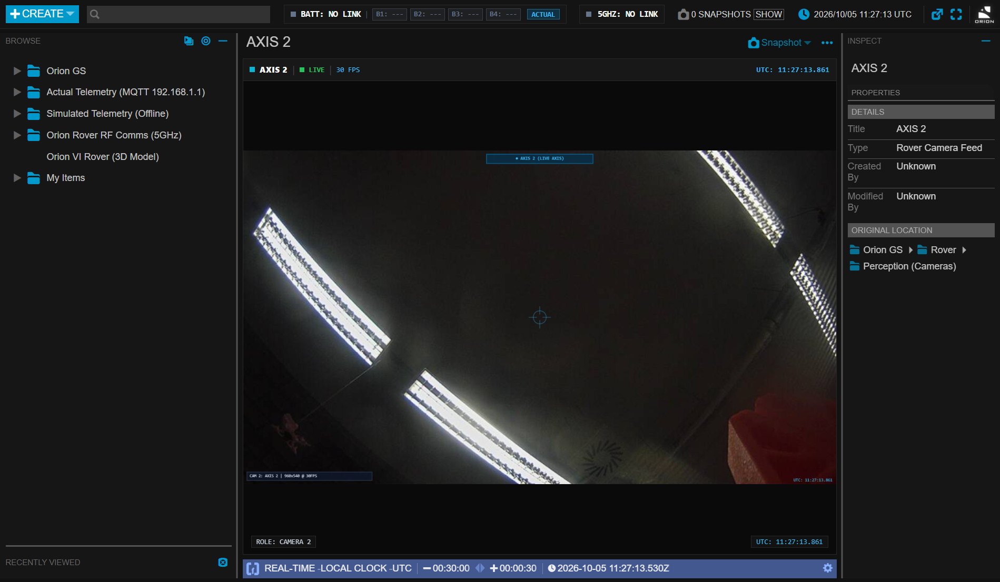

# Orion VI Rover — Multi-Camera & Teleoperation Vision System
### AXIS F34 Network Integration, Repeating 5s Reconnect Watchdog & Native Snapshotting

This document details the architecture, UI layout, AXIS F34 multi-sensor LAN streaming, signal-loss watchdog mechanism, native camera renaming, and popout viewing capabilities of the vision system of the Orion VI Rover.

---

## Visual Interface & Camera Views

### 1. Flexible Layout Tab in Rover Operating Modes
The primary mission perception layout combines the primary teleoperation cameras with auxiliary driving, manipulation, and operator test feeds:


### 2. AXIS F34 Network Cameras (Live 30 FPS Streams & Popout Windows)
The rover carries an **AXIS F34 4-sensor network camera unit** connected via high-speed Ethernet. Video streams are proxied seamlessly into Open MCT tiles and standalone popout windows:

<p align="center">
  
  
</p>

### 3. 5-Second Grace Period & Repeating Force Reconnect Watchdog
When physical camera feeds are disconnected, experiencing RF packet loss, or stalled:
1. **5s Grace Period**: The last valid video frame remains visible and frozen for 5 seconds to gracefully absorb temporary network jitter without flickering.
2. **Repeating Force Reconnect**: At 0s, the application tears down and recreates socket/image elements with cache-busting parameters, repeating every 5 seconds until the link is restored.
3. **Instant Recovery**: As soon as video frames resume, the `NO SIGNAL` overlay disappears immediately.

<p align="center">
  
  
</p>

<p align="center">
  
</p>

---

## Typography & HUD Overlay Standards

Overlaid telemetry, UTC clocks, and watchdog counts use the aerospace monospace standard:
```css
font-family: "JetBrains Mono", Consolas, "Courier New", monospace;
font-weight: 700;
letter-spacing: 0.5px;
```
*Monospace font ensures that the countdown timer (`5s -> 4s -> 3s -> 2s -> 1s -> 0s`) and live UTC timestamp (`16:15:32.400`) update with zero horizontal glyph jitter, maintaining clean readability over live video feeds.*

---

## 1. System Overview & Physical Camera Topology

Perception and situational awareness are critical during competition teleoperation (traverse, sample collection, equipment servicing). The Orion GCS provides a dedicated multi-camera layout supporting the rover's **AXIS F34 Network Camera unit**, local operator test feeds, and rover operational cameras:

```
                      [ Mast Camera (Hero) ]
                                |
          [ Nav Cam Left ] -----+----- [ Nav Cam Right ]
                                |
             +------------------+------------------+
             |                                     |
      [ AXIS Port 2 ]                       [ AXIS Port 3 ]
   (Live 30 FPS Stream)                  (Live 30 FPS Stream)
             |                                     |
      [ Arm Base Cam ]                      [ Chassis Front ]
             |                                     |
      [ Arm Wrist Cam ]                     [ Chassis Rear ]
             |                                     |
      [ Science Bay Cam ]                   [ Underbelly Cam ]
                                                   |
                                         [ 360° Panoramic Cam ]
```

---

## 2. AXIS F34 Network Camera Subsystem

The **AXIS F34 Multi-Sensor Camera System** is a compact, high-performance network camera unit connected directly to the rover's on-board Ethernet switch:

### 1. Network Discovery & Communication
* **Link-Local IP Address**: Configured on the rover LAN at `169.254.186.98`.
* **Zero-Config SSDP Auto-Discovery**: The GCS backend gateway broadcasts SSDP `M-SEARCH * HTTP/1.1` packets across the local subnet (`169.254.255.255:1900`) on startup. It automatically discovers the AXIS unit, extracts its base URL and sensor capabilities, and binds the streaming proxy without requiring manual IP configuration.
* **MJPEG Proxy Streaming**: Video frames are served to Open MCT via `/api/camera/axis/:id/stream` (multipart MJPEG with boundary `myboundary`).
* **Active Stream Caching**: The gateway tracks active stream listeners in memory (`this.activeStreams.set(camId, timestamp)`). When a client is actively consuming the MJPEG stream, redundant background HTTP snapshot polling to the AXIS F34 embedded CPU is automatically suppressed to conserve hardware resources and maintain high frame rates.

### 2. Physical Sensor Ports & Auto-Detection
The AXIS F34 main unit houses 4 sensor ports:
* **Port 2 (`AXIS 2`)**: Connected to high-resolution physical sensor, delivering verified live 30 FPS JPEG video frames (>5 KB payload).
* **Port 3 (`AXIS 3`)**: Connected to high-resolution physical sensor, delivering verified live 30 FPS JPEG video frames (>5 KB payload).
* **Ports 1 & 4**: Unpopulated sensor bays on the main unit; the gateway detects the 2217-byte "No video" placeholder response and gracefully reports appropriate sensor status.

---

## 3. Camera Inventory & Telemetry Mappings

| ID | Key | Camera Name | Source / Transport | Resolution & Rate | Purpose / Operational Role |
| :---: | :--- | :--- | :--- | :--- | :--- |
| **1** | `cam_axis_2` | **AXIS 2** | AXIS F34 LAN (Port 2) | 1280x720 @ 30 FPS | Primary High-Definition Chassis / Nav Stream |
| **2** | `cam_axis_3` | **AXIS 3** | AXIS F34 LAN (Port 3) | 1280x720 @ 30 FPS | Secondary High-Definition Science / Arm Stream |
| **3** | `cam_laptop_test`| **Laptop Webcam** | WebRTC / MediaDevices | 640x480 @ 30 FPS | Ground Operator Local Verification Feed |
| **4** | `cam_usb_test` | **USB Camera** | DirectShow / USB UVC | 640x480 @ 30 FPS | External Ground Station Auxiliary Video |
| **5** | `cam_mast` | **Mast Camera (Hero)** | Downlink / RTSP Proxy | 1920x1080 @ 30 FPS | Hero Long-Range Driving & Target ID |
| **6** | `cam_nav_left` | **Navigation Cam Left** | Stereo Downlink | 1280x720 @ 30 FPS | Stereo Obstacle Detection (RTAB-Map) |
| **7** | `cam_nav_right`| **Navigation Cam Right**| Stereo Downlink | 1280x720 @ 30 FPS | Stereo Obstacle Detection (RTAB-Map) |
| **8** | `cam_arm_wrist`| **Arm Wrist Camera** | Downlink / RTSP Proxy | 1280x720 @ 30 FPS | Macro / Gripper Finger Alignment |
| **9** | `cam_arm_base` | **Arm Base Camera** | Downlink / RTSP Proxy | 1280x720 @ 30 FPS | Manipulator Envelope & Joint Clearance |
| **10**| `cam_front` | **Chassis Front Cam** | Downlink / RTSP Proxy | 1280x720 @ 30 FPS | Forward Wheel & Bogie Clearance |
| **11**| `cam_rear` | **Chassis Rear Cam** | Downlink / RTSP Proxy | 1280x720 @ 30 FPS | Reversing & Antenna Clearance |
| **12**| `cam_science` | **Science Bay Cam** | Downlink / RTSP Proxy | 1280x720 @ 30 FPS | Carousel, Drill & Sample Inspection |

---

## 4. Signal Loss Watchdog & Reconnect Mechanism

When camera feeds are disconnected, transmitting over noisy RF channels, or when the video downlink hardware is offline, the vision subsystem executes a multi-stage resilience protocol:

```
+--------------------------------------------------------------+
| [LIVE UTC: 2026-10-05 13:42:15 UTC]          [CAM 02: AXIS 2]|
|                                                              |
|                                                              |
|                       [ ORION LOGO ]                         |
|                                                              |
|                         NO SIGNAL                            |
|                 Attempting reconnect in 4s...                |
|                                                              |
|                                                              |
| [Status: RECONNECTING]                    [Resolution: AUTO] |
+--------------------------------------------------------------+
```

### Watchdog Rules & Behavior
1. **5-Second Grace Period**:
   - When a video stream drops, loses network packets, or disconnects, the display does NOT immediately flash black or trigger an alarm.
   - The last valid video frame remains visible and frozen for a **5-second grace period** to absorb momentary network jitter.
2. **4.5-Second Stream Freeze Watchdog**:
   - Both backend streaming loops and frontend render elements monitor frame arrival rates.
   - If no new frames arrive for longer than 4.5 seconds (video freeze), the watchdog detects the stall, tears down the hung connection, and initiates the 5-second recovery sequence.
3. **Repeating 5-Second Force Reconnect Loop**:
   - Once the 5s grace period expires, the display transitions to the authentic Orion standby screen (dark `#0a0a0a` grid, centered Orion VI insignia, red `NO SIGNAL` box, live UTC timestamp).
   - An active countdown timer displays: `"Attempting reconnect in 5s..."` counting down each second (`5s -> 4s -> 3s -> 2s -> 1s -> 0s`).
   - At count 0s, the system executes an active **FORCE RECONNECT**:
     - Destroys existing socket and Image DOM elements.
     - Issues a fresh connection request with cache-busting query parameters (`?reconnect=true&t=...`).
     - Actively re-probes the camera gateway endpoint.
   - If the camera is still offline, the 5-second countdown resets and repeats indefinitely until link recovery.
4. **Instant Recovery**:
   - Immediately upon receiving valid frames, the `NO SIGNAL` overlay is removed and live video playback resumes seamlessly.

---

## 5. Native Open MCT Camera Renaming & Persistence

Camera labels and titles are fully integrated into native Open MCT object properties:
* **Native In-Place Editing**: Operators can right-click any camera in the Open MCT object tree or click Edit in the Inspector to rename the camera (e.g., renaming `cam_axis_2` to `"Mast Driving Primary"`).
* **Automatic Session Persistence**: Name changes are automatically saved to `localStorage` under `orion-camera-custom-names`.
* **Zero External Dependencies**: Custom names persist across browser refreshes, application restarts, and system reboots without requiring an external database.

---

## 6. Standalone Popout Windows & Snapshot Engine

Each camera view can be opened independently in a dedicated popout window:

### 1. Multi-Monitor Teleoperation
* Clicking the **Popout** icon on any camera frame opens [`camera-view.html?id=X`](../camera-view.html) in an isolated Electron window or browser tab.
* Allows operators to arrange cameras across 2, 3, or more monitors in the ground station command shelter.

### 2. High-Fidelity Snapshot Export
* Integrated snapshot buttons (`📸 SNAPSHOT`) on camera tiles, enlarged views, and standalone popout windows capture full-resolution PNG frames.
* Captured frames are stored directly in the Open MCT Notebook snapshot drawer (`notebook-snapshot-storage`) and trigger browser downloads for post-mission analysis and engineering debriefs.
